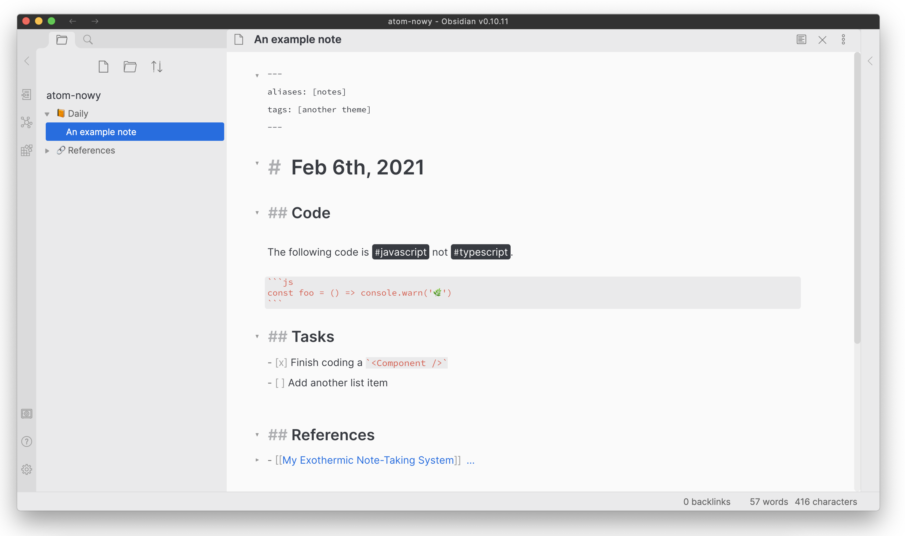
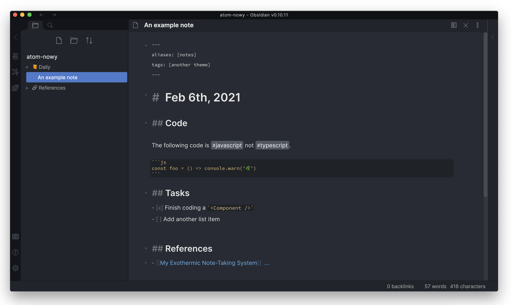

# ⚛️  Obsidian Atom (Nowy)

Based off of [kognise](https://github.com/kognise)'s Atom theme - this
just adds a bit more contrast and a few more hovering states.

### Light

### Dark

## Installation

1. Download `atom-nowy.css` to your Obsidian vault themes folder (`[vault]/.obsidian/themes`).
2. Reload Obsidian.
3. Go to `Settings` -> `Appearance` -> `Themes` and select this theme.
